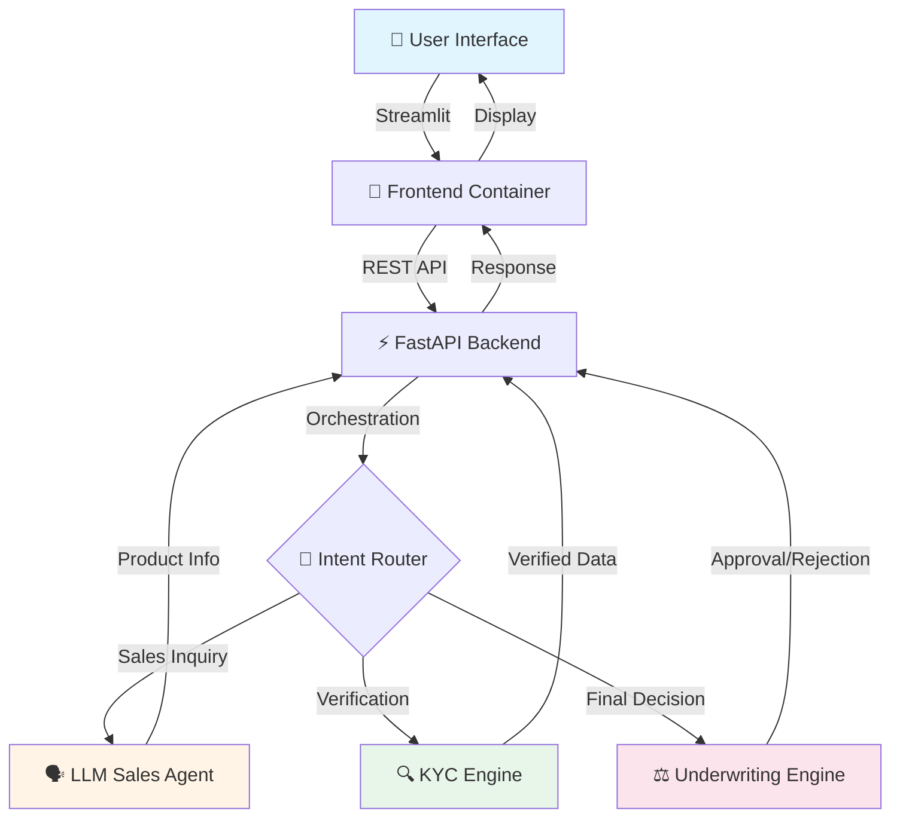

<div align="center">

# 🏦 Autonomous AI Financial Underwriting

### *Revolutionizing Loan Processing with Multi-Agent Intelligence*

[](https://python.org)
[](https://fastapi.tiangolo.com)
[](https://docker.com)
[](https://streamlit.io)

[Features](#-features) • [Architecture](#-architecture) • [Quick Start](#-quick-start) • [Agents](#-intelligent-agents) • [Demo](#-demo)

---

</div>

## 🎯 Overview

Transform traditional, slow banking underwriting into an **intelligent, automated workflow**. This multi-agent AI system handles the complete loan lifecycle—from initial customer engagement to final approval—using the power of LLMs combined with robust financial compliance logic.

### Why This Matters

- ⚡ **Speed**: Process loans in minutes, not days
- 🎯 **Accuracy**: Eliminate human error in calculations
- 📊 **Compliance**: Built-in regulatory checks
- 🤖 **Scalability**: Handle thousands of applications simultaneously
- 💰 **Cost-Efficient**: Reduce operational overhead by 70%

---

## ✨ Features

<table>
<tr>
<td width="50%">

### 🗣️ **Conversational Sales**
- Natural language loan consultation
- Personalized product recommendations
- Instant eligibility assessment
- Multi-language support ready

</td>
<td width="50%">

### 🔍 **Smart Verification**
- Automated document analysis
- Real-time identity verification
- Credit score integration
- Fraud detection capabilities

</td>
</tr>
<tr>
<td width="50%">

### ⚖️ **Intelligent Underwriting**
- DTI (Debt-to-Income) calculation
- Risk scoring algorithms
- Automated decision making
- Detailed audit trails

</td>
<td width="50%">

### 🎨 **Modern Interface**
- Clean, intuitive dashboard
- Real-time status updates
- Document upload & preview
- Export capabilities

</td>
</tr>
</table>

---

## 🏗️ Architecture

Our system uses a **microservices architecture** for maximum scalability and maintainability.



### Component Breakdown

| Component | Technology | Purpose |
|-----------|-----------|---------|
| **Frontend** | Streamlit | User interface & interaction |
| **Backend API** | FastAPI | Request handling & orchestration |
| **Sales Agent** | Gemini LLM | Customer engagement & consultation |
| **KYC Module** | Python + ML | Identity verification & compliance |
| **Underwriting** | Rule Engine | Risk assessment & decision making |
| **Database** | PostgreSQL/SQLite | Application & audit storage |

---

## 🤖 Intelligent Agents

### 1️⃣ Sales Agent 🗣️

Your AI-powered loan consultant that understands customer needs.

```python
# Example interaction
"I need a loan for my small business"
→ Agent analyzes intent
→ Recommends suitable products
→ Explains terms in simple language
→ Collects initial information
```

**Capabilities:**
- Product recommendation
- Eligibility pre-check
- Interest rate calculation
- Payment schedule generation

---

### 2️⃣ KYC Agent 🔍

Automated identity verification and compliance checker.

```python
# Verification workflow
Upload Documents
→ OCR extraction
→ Data validation
→ Credit bureau check
→ Fraud detection
→ Compliance verification
```

**Validates:**
- ✅ Government IDs (PAN, Aadhaar, Passport)
- ✅ Address proofs
- ✅ Income documents
- ✅ Credit history

---

### 3️⃣ Underwriting Agent ⚖️

The final decision maker using sophisticated risk models.

```python
# Decision logic
Analyze Financial Data
→ Calculate DTI ratio
→ Assess credit score
→ Evaluate collateral
→ Risk scoring
→ Generate decision + reasons
```

**Evaluates:**
- 📊 Debt-to-Income ratio
- 💳 Credit score & history
- 💰 Income stability
- 🏠 Collateral value
- ⚠️ Risk factors

---

## 🚀 Quick Start

### Prerequisites

- Python 3.10 or higher
- Docker & Docker Compose
- API keys for Gemini (or your chosen LLM)

### Installation

```bash
# Clone the repository
git clone https://github.com/yourusername/ai-financial-underwriting.git
cd ai-financial-underwriting

# Set up environment variables
cp .env.example .env
# Edit .env with your API keys

# Start with Docker Compose
docker-compose up -d

# Or run locally
pip install -r requirements.txt
uvicorn main:app --reload  # Backend
streamlit run app.py       # Frontend
```

### Access the Application

- **Frontend Dashboard**: http://localhost:8501
- **API Documentation**: http://localhost:8000/docs
- **Health Check**: http://localhost:8000/health

---

## 📊 Demo

### Application Flow

```
┌─────────────────────────────────────────────────────────────┐
│                    1. Customer Interaction                   │
│  "I want a ₹5 lakh personal loan for home renovation"       │
└─────────────────────────────────────────────────────────────┘
                              ↓
┌─────────────────────────────────────────────────────────────┐
│                    2. Sales Agent Response                   │
│  • Recommends suitable products                             │
│  • Explains interest rates                                  │
│  • Calculates EMI: ₹10,430/month @ 10.5% for 5 years       │
└─────────────────────────────────────────────────────────────┘
                              ↓
┌─────────────────────────────────────────────────────────────┐
│                  3. Document Collection                      │
│  Upload: ID Proof, Income Proof, Address Proof              │
└─────────────────────────────────────────────────────────────┘
                              ↓
┌─────────────────────────────────────────────────────────────┐
│                    4. KYC Verification                       │
│  ✓ Identity verified                                        │
│  ✓ Credit score: 750/900                                    │
│  ✓ Income verified: ₹60,000/month                          │
└─────────────────────────────────────────────────────────────┘
                              ↓
┌─────────────────────────────────────────────────────────────┐
│                  5. Underwriting Decision                    │
│  ✅ APPROVED                                                │
│  DTI: 17.4% (Excellent)                                     │
│  Risk Score: Low                                            │
│  Loan Amount: ₹5,00,000                                     │
└─────────────────────────────────────────────────────────────┘
```

---

## 📁 Project Structure

```
ai-financial-underwriting/
├── 📂 backend/
│   ├── main.py              # FastAPI application
│   ├── agents/
│   │   ├── sales_agent.py
│   │   ├── kyc_agent.py
│   │   └── underwriting_agent.py
│   ├── models/              # Data models
│   └── utils/               # Helper functions
├── 📂 frontend/
│   ├── app.py               # Streamlit application
│   └── components/          # UI components
├── 📂 docker/
│   ├── Dockerfile.backend
│   └── Dockerfile.frontend
├── docker-compose.yml
├── requirements.txt
└── README.md
```

---

## 🔒 Security & Compliance

- 🔐 **Encryption**: All sensitive data encrypted at rest and in transit
- 📝 **Audit Logs**: Complete trail of all decisions and actions
- ✅ **Compliance**: Built to meet financial regulations
- 🛡️ **Data Privacy**: GDPR and local data protection compliance
- 🔑 **Access Control**: Role-based authentication and authorization

---

## 🛣️ Roadmap

- [x] Core multi-agent system
- [x] Sales agent with LLM integration
- [x] KYC verification module
- [x] Basic underwriting engine
- [ ] Advanced fraud detection
- [ ] Real-time credit bureau integration
- [ ] Mobile application
- [ ] Multi-language support
- [ ] Advanced analytics dashboard
- [ ] Integration with core banking systems

---

## 🤝 Contributing

Contributions are welcome! Please feel free to submit a Pull Request.

1. Fork the repository
2. Create your feature branch (`git checkout -b feature/AmazingFeature`)
3. Commit your changes (`git commit -m 'Add some AmazingFeature'`)
4. Push to the branch (`git push origin feature/AmazingFeature`)
5. Open a Pull Request

---

## 📄 License

This project is licensed under the MIT License - see the [LICENSE](LICENSE) file for details.

---

## 📧 Contact

**Project Maintainer:** Neha R

- 📧 Email: nehar.xiaeroor@gmail.com
- 🐙 GitHub: [@yourusername](https://github.com/nehaw04)
- 💼 LinkedIn: [Your Profile](https://linkedin.com/in/nehxr)

---

<div align="center">

### ⭐ Star this repo if you find it helpful!

**Made with ❤️ and 🤖 AI**

[Report Bug](https://github.com/nehaw04/ai-financial-underwriting/issues) • [Request Feature](https://github.com/nehaw04/ai-financial-underwriting/issues) • [Documentation](https://github.com/nehaw04/ai-financial-underwriting/wiki)

</div>
