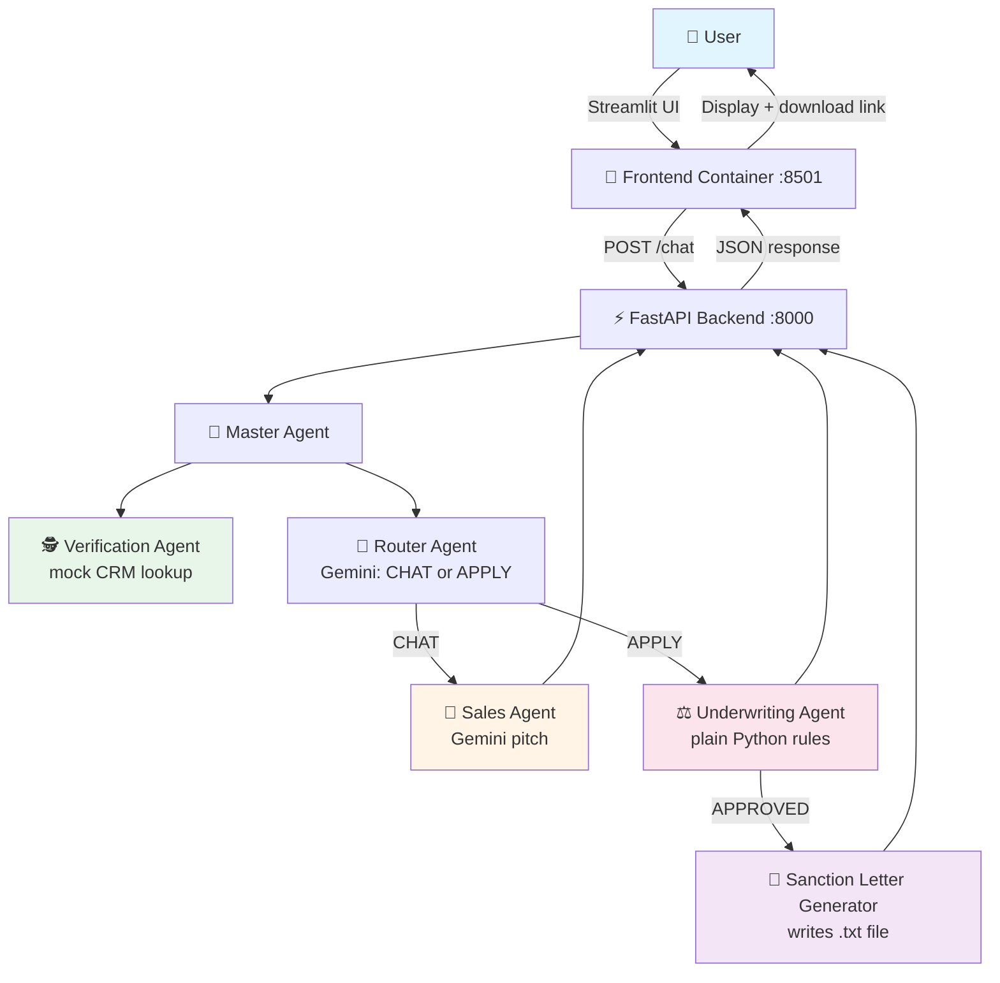

<div align="center">

# 🏦 Loan Buddy

### *A Multi-Agent AI Prototype for Simulated Loan Processing*

[](https://python.org)
[](https://fastapi.tiangolo.com)
[](https://docker.com)
[](https://streamlit.io)
[](https://ai.google.dev)

[Overview](#-overview) • [Architecture](#%EF%B8%8F-architecture) • [Agents](#-the-five-agents) • [Quick Start](#-quick-start) • [Demo](#-demo-walkthrough) • [Limitations](#-honest-limitations)

---

</div>

## 🎯 Overview

Loan Buddy is a **prototype** that simulates a bank's personal-loan workflow using a multi-agent design. Instead of one large LLM call trying to do everything, the work is split across five narrowly scoped agents — Verification, Routing, Sales, Underwriting, and Document Generation — coordinated by a single **Master Orchestrator**.

The core design bet: **language tasks stay with the LLM, financial decisions stay in plain deterministic code.** Google Gemini writes the sales pitch and classifies user intent. Everything that touches money — credit checks, approval thresholds — is ordinary Python with no model call involved.

This is a demo/hackathon-style build (also shown as "EY Agentic Banker"), running against two hardcoded personas, not a production banking system.

### What it actually demonstrates

- 🧩 **Separation of concerns** — an orchestrator delegating to specialized agents instead of one monolithic prompt
- 🎯 **Deliberate LLM boundaries** — persuasion and intent detection use Gemini; approval/rejection logic never does
- 🏗️ **Containerized microservice split** — independent frontend and backend services via Docker Compose
- 🔁 **A full simulated loan journey** — identity check → intent detection → sales pitch or underwriting → sanction letter

---

## ✨ Features (as actually built)

<div align="center">
<table>
<tr>
<td width="50%">

### 🗣️ **Conversational Sales**
- LLM-generated persuasive pitch per user
- Pulls real scheme data (rate, tenure) into the prompt
- Adapts tone based on user hesitation
- Two-persona demo (more require code changes)

</td>
<td width="50%">

### 🔍 **KYC Check**
- Name lookup against a mock CRM dictionary
- Fails fast if the name isn't recognized
- Returns phone, address, and city from mock data
- No document upload or OCR — this is a lookup, not verification

</td>
</tr>
<tr>
<td width="50%">

### ⚖️ **Rule-Based Underwriting**
- Four explicit, hardcoded rules (see below)
- No LLM involved — fully deterministic
- EMI-to-income check for the "grey zone" between 1x–2x limit
- Same input always produces the same output

</td>
<td width="50%">

### 🎨 **Streamlit Interface**
- Persona switcher (2 hardcoded users)
- Chat-style interaction with typewriter reply
- Checkbox to simulate salary-slip upload
- Download link for the generated letter on approval

</td>
</tr>
</table>
</div>

---

## 🏗️ Architecture

Two containers, coordinated by Docker Compose:


```mermaid
graph TB
    A[👤 User] -->|Streamlit UI| B[🎨 Frontend Container :8501]
    B -->|POST /chat| C[⚡ FastAPI Backend :8000]
    C --> M[🧭 Master Agent]
    M --> V[🕵️ Verification Agent<br/>mock CRM lookup]
    M --> R[🧠 Router Agent<br/>Gemini: CHAT or APPLY]
    R -->|CHAT| S[💼 Sales Agent<br/>Gemini pitch]
    R -->|APPLY| U[⚖️ Underwriting Agent<br/>plain Python rules]
    U -->|APPROVED| G[📄 Sanction Letter Generator<br/>writes .txt file]
    S --> C
    U --> C
    G --> C
    C -->|JSON response| B
    B -->|Display + download link| A

    style A fill:#e1f5ff
    style S fill:#fff4e6
    style V fill:#e8f5e9
    style U fill:#fce4ec
    style G fill:#f3e5f5
```

### Component Breakdown

| Component | Technology | Purpose |
|-----------|-----------|---------|
| **Frontend** | Streamlit | Chat UI, persona switcher, download button |
| **Backend API** | FastAPI + Pydantic | Validates requests, calls the Master Agent |
| **Sales & Router Agents** | Gemini (`gemini-flash-latest`) | Intent classification and persuasive pitch generation |
| **Verification & Underwriting** | Plain Python | Deterministic lookups and rule checks — no LLM |
| **Data storage** | In-memory Python dictionaries | No database engine; data resets on container restart |
| **Containerization** | Docker + Docker Compose | Two services: `backend`, `frontend` |

---

## 🤖 The Five Agents

### 1️⃣ Router Agent 🧭

Classifies user intent so the rest of the pipeline knows which path to take.

```python
# Prompt asks Gemini for exactly one word
"I'm not sure about this..." → CHAT
"Yes, go ahead and approve me" → APPLY
```

Decision is read back with a simple string-contains check on the model's output.

---

### 2️⃣ Sales Agent 💼

Runs only on the CHAT path. Pure LLM, no decision authority.

**What it actually does:**
- Builds a prompt with the user's name, message, pre-approved limit, and the specific schemes (rate + tenure) pulled from mock data
- Asks Gemini to write a persuasive, VIP-toned pitch that ends with a direct question
- Returns the generated text as-is — it doesn't calculate anything itself

---

### 3️⃣ Verification Agent 🕵️

Deterministic, no LLM. Looks the user's name up in a two-entry dictionary (`MOCK_CRM`). If the name isn't found, the whole pipeline halts before any other agent runs.

---

### 4️⃣ Underwriting Agent ⚖️

The decision-maker — and deliberately **not** an LLM.

```python
# underwriting_logic() — four explicit rules
1. credit_score < 700              → REJECTED
2. amount <= pre_approved_limit    → APPROVED INSTANTLY
3. amount > 2 × pre_approved_limit → REJECTED
4. amount between 1x–2x limit:
     no salary slip                → PENDING_DOCS
     salary slip + EMI ≤ income/2  → APPROVED (manual underwriting)
     salary slip + EMI > income/2  → REJECTED
```

Where `estimated_emi = (requested_amount × 1.10) / 60`. This is a simplified EMI-to-income check, not a formal DTI ratio calculation.

---

### 5️⃣ Sanction Letter Generator 📄

I/O only, no logic. On approval, writes a formatted `Sanction_Letter.txt` with the applicant's name, product, and amount, and makes it available for download.

---

## 🚀 Quick Start

### Prerequisites

- Docker & Docker Compose
- A Google Gemini API key ([ai.google.dev](https://ai.google.dev))

### Run with Docker Compose

```bash
# Clone the repository
git clone https://github.com/nehaw04/ai-financial-underwriting.git
cd ai-financial-underwriting

# Add your Gemini key
echo "GOOGLE_API_KEY=your_key_here" > backend/.env

# Start both services
docker-compose up --build
```

### Run locally without Docker

```bash
# Backend
cd backend
pip install -r requirements.txt
echo "GOOGLE_API_KEY=your_key_here" > .env
uvicorn api:app --reload --port 8000

# Frontend (in a separate terminal)
cd frontend
pip install -r requirements.txt
streamlit run app.py
```

### Access the Application

- **Frontend Chat UI**: http://localhost:8501
- **API Docs (Swagger)**: http://localhost:8000/docs

> There is currently no `/health` endpoint — it's on the roadmap below.

---

## 📊 Demo Walkthrough

A real trace through the actual code, using the "Alex Johnson" persona (credit score 720, $50,000 pre-approved limit):

```
┌──────────────────────────────────────────────────────────────┐
│  1. User: "I want a $80,000 loan"                            │
│     → Router Agent classifies this as APPLY                  │
└──────────────────────────────────────────────────────────────┘
                              ↓
┌──────────────────────────────────────────────────────────────┐
│  2. Underwriting Agent runs the four rules:                  │
│     • Credit score 720 ≥ 700               → passes          │
│     • $80,000 > $50,000 limit              → not instant     │
│     • $80,000 ≤ 2 × $50,000 ($100,000)     → grey zone       │
│     • salary_slip_uploaded = False         → PENDING_DOCS    │
└──────────────────────────────────────────────────────────────┘
                              ↓
┌──────────────────────────────────────────────────────────────┐
│  3. User checks the "Simulate Salary Slip Upload" box         │
│     and says "Proceed"                                       │
└──────────────────────────────────────────────────────────────┘
                              ↓
┌──────────────────────────────────────────────────────────────┐
│  4. Underwriting re-runs:                                    │
│     estimated_emi = (80,000 × 1.10) / 60 ≈ $1,467            │
│     income / 2 = $37,500                                     │
│     $1,467 ≤ $37,500 → APPROVED via manual underwriting      │
└──────────────────────────────────────────────────────────────┘
                              ↓
┌──────────────────────────────────────────────────────────────┐
│  5. Sanction_Letter.txt is generated and offered as a         │
│     download from the Streamlit UI                            │
└──────────────────────────────────────────────────────────────┘
```

---

## 📁 Project Structure

```
ai-financial-underwriting/
├── 📂 backend/
│   ├── Dockerfile           # Backend container configuration
│   ├── api.py                # FastAPI routes: /chat, /download-sanction
│   ├── main.py                # Master Agent + all five agent functions
│   ├── requirements.txt       # Backend dependencies
│   └── tools.py                # Mock CRM/Bureau/Offers + underwriting rules
├── 📂 frontend/
│   ├── Dockerfile           # Frontend container configuration
│   ├── app.py                # Streamlit chat UI
│   └── requirements.txt       # Frontend dependencies
├── .gitignore
├── README.md
├── check_model.py           # Lists Gemini models available to your API key
└── docker-compose.yml       # Two-service orchestration
```

---

## ⚠️ Honest Limitations

This is a working prototype, not a production system. Being upfront about what's *not* here:

- **No database** — all data lives in in-memory Python dictionaries and resets on restart
- **No authentication** — every endpoint is open to anyone who can reach it
- **No encryption, audit logging, or regulatory compliance controls**
- **No real document handling** — the "salary slip upload" is a checkbox, not a file; there's no OCR or ID verification
- **Synchronous only** — one request runs the full agent chain before the next starts; not built for concurrent load
- **Sanction letter is a `.txt` file**, not an actual PDF
- **Two unused dependencies** (`onnxruntime`, `cffi`) sit in `backend/requirements.txt` but aren't imported anywhere

---

## 🛣️ Roadmap

**Built:**
- [x] Master Orchestrator + five-agent pipeline
- [x] Gemini-powered Router and Sales agents
- [x] Rule-based underwriting engine (four explicit rules)
- [x] Dockerized two-service deployment

**Not yet built:**
- [ ] Real database (PostgreSQL) replacing the mock dictionaries
- [ ] Authentication and role-based access control
- [ ] Async/queued agent calls (e.g. Celery + Redis) for concurrent users
- [ ] Real PDF generation for the sanction letter
- [ ] Genuine document upload with OCR-based income verification
- [ ] Fraud-detection agent between KYC and Router
- [ ] `/health` endpoint and structured logging
- [ ] Multi-language support
- [ ] Mobile application

---

## 🤝 Contributing

Contributions are welcome! Please feel free to submit a Pull Request.

1. Fork the repository
2. Create your feature branch (`git checkout -b feature/AmazingFeature`)
3. Commit your changes (`git commit -m 'Add some AmazingFeature'`)
4. Push to the branch (`git push origin feature/AmazingFeature`)
5. Open a Pull Request

---

## 📄 License

This project is licensed under the MIT License - see the [LICENSE](LICENSE) file for details.

---

## 📧 Contact

**Project Maintainer:** Neha

- 📧 Email: [click here](mailto:nehar.xiaeroor@gmail.com)
- 🐙 GitHub: [@nehaw04](https://github.com/nehaw04)
- 💼 LinkedIn: [Neha](https://linkedin.com/in/nehxr)

---

<div align="center">

### ⭐ Star this repo if you find it helpful!

**Made with ❤️ and 🤖 AI**

[Report Bug](https://github.com/nehaw04/ai-financial-underwriting/issues) • [Request Feature](https://github.com/nehaw04/ai-financial-underwriting/issues)

</div>
